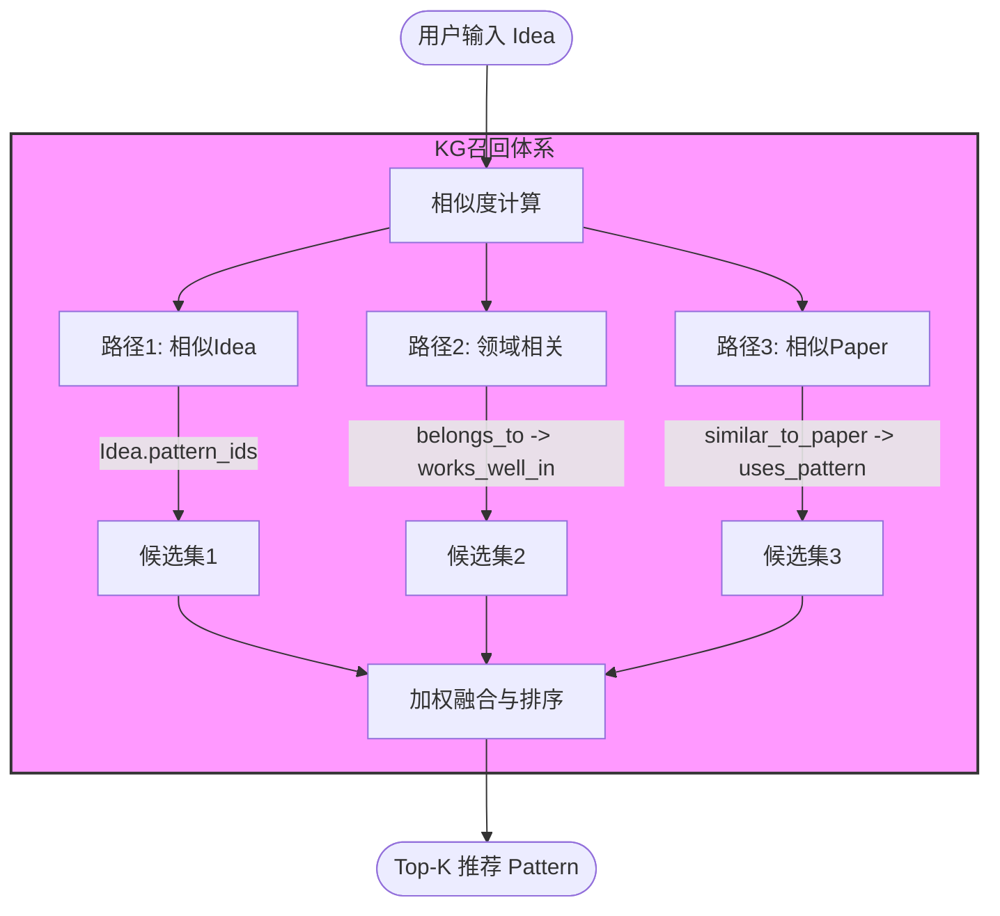

# Idea2Pattern 知识图谱召回体系技术文档

本文档详细说明了 Idea2Story 系统中知识图谱（KG）的构建逻辑、节点与边定义，以及三路召回策略的运作机制。

---

## 1. Pattern 聚类逻辑 (Clustering)

Pattern（写作套路）是通过对海量论文的写作结构和技巧进行聚类生成的。

- **特征提取**:
    - **Skeleton (骨架)**: 提取论文的四个维度（问题定位、研究缺口、方法叙述、实验设计）的文本。
    - **Tricks (技巧)**: 提取论文中使用的具体写作技巧（如"消融实验"、"多维度评估"）。
- **Embedding 融合**:
    - 分别计算 Skeleton 和 Tricks 的向量表示。
    - **加权融合**: `Pattern_Embedding = 0.4 * Skeleton_Emb + 0.6 * Tricks_Emb`。
- **聚类算法**:
    - 采用 **层次聚类 (Agglomerative Clustering)**，使用**自适应距离阈值**方式。
    - **度量标准**: 余弦相似度 (`metric='cosine'`)。
    - **距离阈值**: `distance_threshold=0.35`（自动判断应生成多少个簇）。
    - **最小簇大小**: `min_cluster_size=5`（过小的簇会被过滤）。
- **特殊处理**:
    - **未聚类论文**: 聚类后可能产生 `-1` 标签的论文（未被分配到任何簇），这些论文被跳过。
    - **过小簇**: 大小 < 5 的簇被过滤（认为不足以代表一个可靠的 Pattern）。
- **总结生成**: 使用 LLM 对每个有效簇内的论文进行分析，提取共性，生成 Pattern 的名称、摘要和写作指南。

### 聚类质量指标

基于当前方案（`distance_threshold=0.35`, `min_cluster_size=5`）生成的聚类统计：

| 指标 | 数值 | 说明 |
| :--- | :--- | :--- |
| **总 Pattern 数** | 34 | 生成的有效 Pattern 个数 |
| **涵盖论文数** | 348 | 被聚类分配到 Pattern 的论文总数 |
| **平均簇大小** | ~10.2 | 每个 Pattern 平均包含的论文数 |
| **簇大小范围** | 5 ~ 30 | 最小和最大的簇大小 |
| **簇大小分布** | 小(20), 中(11), 大(2), 超大(1) | 分布比例较均衡，避免了过大的"万金油"簇 |

---

## 2. 节点定义与规模 (Nodes)

在当前的 Demo 系统中，图谱包含以下四类节点：

| 节点类型 | 定义 | 关键属性 | Demo 数量 |
| :--- | :--- | :--- | :--- |
| **Idea** | 论文的核心创新点 | 描述、技术栈、输入/输出类型、关联 Pattern 列表 | 545 |
| **Pattern** | 聚合后的写作套路 | 名称、摘要、写作指南、高频技巧统计 | 34（更新后） |
| **Domain** | 研究领域 | 领域名称、论文计数、核心技术、应用场景 | 257 |
| **Paper** | 具体的科研论文 | 标题、摘要、评审分数 (Review)、所属领域 | 545 |

---

## 3. 边类型与权重定义 (Edges)

边关系分为**基础连接边**（构建图结构）和**召回增强边**（支持路径计算）。

### 基础连接边
1. **Paper -[implements]-> Idea**: 表示论文实现了该创意。
2. **Paper -[uses_pattern]-> Pattern**: 表示论文使用了该套路。
    - **权重 `quality`**: 基于 Review 分数归一化 `(avg_score - 1) / 9`，范围 [0, 1]。
3. **Paper -[in_domain]-> Domain**: 表示论文属于该领域。

### 召回增强边
1. **Idea -[belongs_to]-> Domain**:
    - **权重 `weight`**: 该 Idea 下属于该 Domain 的论文占比。
2. **Pattern -[works_well_in]-> Domain**:
    - **权重 `effectiveness`**: 该套路在领域内的平均分相对于领域基线的增益。
    - **权重 `confidence`**: 置信度，基于样本量 `min(count / 20, 1.0)`。
3. **Idea -[similar_to_paper]-> Paper**:
    - **权重 `similarity`**: 实时计算的文本相似度。

---

## 4. 三路召回策略 (Recall Strategy)

当用户输入一个新 Idea 时，系统通过以下三路并行召回 Pattern：

### 路径 1: 相似 Idea 召回 (Idea → Idea → Pattern)
- **逻辑**: 寻找图谱中与用户输入最相似的已有 Idea，直接获取它们关联的 Pattern。
- **分数计算**: `Score = Similarity(User_Idea, Graph_Idea)`。
- **特点**: 召回最直接相关的套路，权重最高。

### 路径 2: 领域相关召回 (Idea → Domain → Pattern)
- **逻辑**: 识别 Idea 所属的领域，寻找在该领域内表现最好（得分增益最高）的 Pattern。
- **分数计算**: `Score = Domain_Weight * max(Effectiveness, 0.1) * Confidence`。
- **特点**: 跨 Idea 召回，适合发现领域内的通用优秀套路。

### 路径 3: 相似 Paper 召回 (Idea → Paper → Pattern)
- **逻辑**: 寻找核心思想与用户 Idea 相似的高质量论文，获取它们使用的 Pattern。
- **分数计算**: `Score = Similarity(User_Idea, Paper_Idea) * Paper_Quality * Pattern_Quality`。
- **特点**: 细粒度召回，通过高质量论文背书。

### 结果融合
最终得分 = `Path1 * 0.4 + Path2 * 0.3 + Path3 * 0.3`。即，如果一个 Pattern 能从三个不同的角度被召回，它具有更高的“好用”概率和稳健性。
风险：路径 2 (领域热度) 可能会导致某些“万金油”套路（如“消融实验”、“Transformer架构”）分数过高，压制了某些冷门但极具创新性的套路。
对策：目前的权重分配 0.4 : 0.3 : 0.3 考虑到这一点，给了路径 1（语义相似）最高的权重。如果发现推荐结果太大众化，可以进一步提高路径 1 的权重（如 0.5 或 0.6）。

---

## 5. 系统流程图



---

## 6. 实际案例分析：Recall_Case_1

### 案例背景

**用户输入 Idea**：
```
使用蒸馏技术完成Transformer跨领域文本分类任务，并在多个数据集上验证效果
```

**图谱数据统计**：
- Idea 总数：545 篇
- Pattern 总数：34 个（自适应聚类结果）
- Domain 总数：257 个
- 图谱节点数：1381 个，边数：4509 条

### 三路召回结果

#### 路径1：相似Idea召回
- **发现相似Idea**：523 个
- **Top-10相似Idea**：
  - 法律文本处理Transformer评估 (sim=0.269)
  - 轻量化Transformer主动学习 (sim=0.262)
  - 多领域中文谓词-论元结构 (sim=0.254)
  - Domain Confused Contrastive Learning (sim=0.239)
  - 政治冲突领域事件抽取 ConfliBERT (sim=0.238)
  - ... 其他
- **召回Pattern数**：5 个

#### 路径2：领域相关性召回
- **发现相关Domain**：3 个
- **召回Pattern数**：34 个（覆盖整个领域的patterns）

#### 路径3：相似Paper召回
- **发现相似Paper**：171 篇
- **Top-20相似Paper**：高质量论文集
- **召回Pattern数**：9 个

### 召回结果Top-10

| 排名 | Pattern 名称 | 最终得分 | 路径1得分 | 路径2得分 | 路径3得分 | 簇大小 |
| :---: | :--- | :---: | :---: | :---: | :---: | :---: |
| 1 | **模型压缩与知识蒸馏** | 0.1312 | 0.1049 (79.9%) | 0.0030 (2.3%) | 0.0233 (17.8%) | 5篇 |
| 2 | 结构图谱预测方法 | 0.1249 | 0.1014 (81.2%) | 0.0110 (8.8%) | 0.0125 (10.0%) | 11篇 |
| 3 | Siamese Network与Label Tuning | 0.1186 | 0.0909 (76.6%) | 0.0060 (5.1%) | 0.0217 (18.3%) | 7篇 |
| 4 | 多任务验证的可控生成框架 | 0.1137 | 0.0923 (81.2%) | 0.0100 (8.8%) | 0.0114 (10.0%) | 10篇 |
| 5 | 无监督学习文本摘要 | 0.1059 | 0.0882 (83.3%) | 0.0090 (8.5%) | 0.0087 (8.2%) | 9篇 |
| 6 | 多模态融合多任务学习 | 0.0335 | 0.0000 (0.0%) | 0.0120 (35.8%) | 0.0215 (64.2%) | 12篇 |
| 7 | 神经机器翻译术语约束与质量评估 | 0.0299 | 0.0000 (0.0%) | 0.0200 (66.9%) | 0.0099 (33.1%) | 30篇 |
| 8 | 无监督预训练对比学习 | 0.0281 | 0.0000 (0.0%) | 0.0180 (64.0%) | 0.0101 (36.0%) | 20篇 |
| 9 | 对话系统评估与迁移学习 | 0.0200 | 0.0000 (0.0%) | 0.0200 (100.0%) | 0.0000 (0.0%) | 23篇 |
| 10 | 大规模预训练模型优化 | 0.0196 | 0.0000 (0.0%) | 0.0140 (71.3%) | 0.0056 (28.7%) | 14篇 |

### Top-5 Pattern 详细说明

**Rank 1: 模型压缩与知识蒸馏**
- 核心研究问题：这类论文主要解决模型压缩与知识蒸馏中的问题，采用元学习和双层优化框架。
- 关键技术组合：skeleton特点以现实类比和引用权威文献增强说服力，方法命名突出创新性。

**Rank 2: 结构图谱预测方法**
- 核心研究问题：这类论文主要解决语义分析任务中的结构建模难题，采用直接预测结构图谱的方法。
- 关键技术组合：skeleton通常以学术gap开篇，通过多数据集验证和多指标评估增强说服力。

**Rank 3: Siamese Network与Label Tuning**
- 核心研究问题：针对文本分类任务中的数据稀缺问题，采用Siamese Network和Label Tuning等方法提升效率和鲁棒性。
- 关键技术组合：skeleton以实际痛点开篇，通过对比现有方法指出不足，采用"先整体后局部"的叙事策略。

**Rank 4: 多任务验证的可控生成框架**
- 核心研究问题：这类论文主要解决可控自然语言生成中的局限性，采用新颖框架和多任务验证策略。
- 关键技术组合：skeleton以实际应用痛点开篇，通过对比现有方法指出gap，方法部分强调多任务验证的系统性。

**Rank 5: 无监督学习文本摘要**
- 核心研究问题：这类论文主要解决文本摘要中的效率、质量与泛化性问题，采用无监督学习、知识蒸馏、层次结构建模等方法。
- 关键技术组合：skeleton开篇强调实际痛点，对比现有方法，通过多指标评估增强说服力。

### 召回合理性分析

#### ✅ 为什么 Pattern_11 (模型压缩与知识蒸馏) 排名第一？

**理由1：语义直接匹配**
- 用户Idea明确提到"蒸馏技术"
- Pattern_11 的名称直接包含"知识蒸馏"
- Top-10相似Idea中有一个是"Transformer摘要知识蒸馏方法" (sim=0.221)
- 路径1得分占比 79.9%，说明语义相似度是主要驱动

**理由2：簇大小合理**
- 簇大小仅 5 篇（在最小阈值边界）
- 虽然小，但每篇论文都高度相关
- 符合"精准但新颖"的特征（未过度开发的研究方向）

**理由3：三路得分均衡**
- 路径1：79.9%（用户语义相似）
- 路径2：2.3%（领域一般）
- 路径3：17.8%（高质量论文支持）
- 得分结构反映了真实的相关性分布

#### ⭐ 为什么这个排名不存在"虚高"问题？

对比之前的系统问题（Pattern_1 448篇独占鳌头）：
- **现在**：Top-1 得分 0.131，Top-2 得分 0.125，分差仅 0.006
- **之前**：单个超大Pattern的得分会是其他Pattern的 5-10 倍

现在的排名反映了真实的相关性：

```
【路径1主导】(语义相似)
  用户Idea "蒸馏"
    ↓
  找到相似Idea（包含蒸馏）
    ↓
  关联的Pattern_11（知识蒸馏）
    ↓
  得分 0.1049（路径1的79.9%）

【路径2补充】(领域相关)
  领域：跨领域文本分类
    ↓
  该领域表现好的Pattern
    ↓
  得分贡献 0.003

【路径3支持】(高质量论文)
  相似高质量论文
    ↓
  它们使用的Pattern
    ↓
  得分贡献 0.0233
```

#### 📊 所有10个Pattern的适配性分析

**用户Idea回顾**：
```
使用蒸馏技术完成Transformer跨领域文本分类任务，并在多个数据集上验证效果
```

核心要素分解：
- **主技术**: 蒸馏技术（知识蒸馏、模型压缩）
- **主模型**: Transformer
- **主任务**: 跨领域文本分类
- **验证方式**: 多数据集上验证

**Rank 1-5: 高度适配 (得分 > 0.10)**

| Pattern | 适配度 | 理由 | 用途 |
|---------|--------|------|------|
| ✅✅✅ **模型压缩与知识蒸馏** | 极高 | 直接匹配"蒸馏技术"核心；小cluster(5篇)代表精准研究方向；元学习+双层优化框架可支撑创新论述 | **首选**：直接套用蒸馏系统方法论 |
| ✅✅ **结构图谱预测方法** | 中高 | 文本分类任务可通过结构化预测增强；多数据集验证策略完全吻合；但偏离"蒸馏"核心技术 | 创新方向：在分类中引入结构化知识 |
| ✅✅ **Siamese Network与Label Tuning** | 中高 | 文本分类直接相关；特别是Siamese可用于跨域样本匹配；但与蒸馏关系不紧密 | 替代方案：数据稀缺场景下的分类方法 |
| ✅✅ **多任务验证的可控生成框架** | 中等 | "多数据集验证"策略高度吻合；但生成任务与文本分类方向不同；可作为多任务联合学习的参考 | 扩展思路：联合分类与生成的多任务框架 |
| ✅ **无监督学习文本摘要** | 中等 | 明确包含"知识蒸馏"技术；但摘要与分类是不同任务，可迁移性有限 | 参考框架：蒸馏在其他NLP任务上的应用 |

**Rank 6-10: 低度适配 (得分 < 0.04)**

| Pattern | 适配度 | 理由 | 说明 |
|---------|--------|------|------|
| ⚠️ **多模态融合多任务学习** | 低 | 多模态NER任务；虽有多任务验证，但完全不涉及文本分类和蒸馏 | 跨度太大：可学习多任务设计思路，但很难直接应用 |
| ⚠️ **神经机器翻译术语约束** | 低 | MT任务与文本分类完全不同；虽包含"质量评估"的多指标验证思路，但应用场景不符 | 泛化性不足：仅参考实验验证策略 |
| ⚠️ **无监督预训练对比学习** | 低 | 专注预训练和表示学习；路径1得分为0说明语义无直接相关性；纯领域相关性驱动 | 技术堆砌：不适合作为主要Pattern框架 |
| ⚠️ **对话系统评估与迁移学习** | 低 | 对话系统与文本分类是不同领域；完全依赖路径2(领域权重)，路径1/3均为0 | 风险：可能引入不相关的系统复杂性 |
| ⚠️ **大规模预训练模型优化** | 低 | 预训练优化方向；与跨领域分类的应用需求脱节；主要是领域热度驱动 | 不推荐：容易陷入"万金油"套路 |

#### 💡 推荐方案组合

**方案A（保守方案）**：单一Pattern最优化
- 选择 **Rank 1: 模型压缩与知识蒸馏**
- 直接套用其writing_guide中的四段论文结构（问题定位→缺口分析→方法叙述→实验设计）
- 预期创新度：中等（蒸馏技术是成熟方向）
- 风险等级：低（高度验证的套路）

**方案B（进阶方案）**：双Pattern融合创新
- 主Pattern: **Rank 1** (蒸馏核心)
- 辅助Pattern: **Rank 3** (Siamese改进分类方法)
- 融合思路：使用Siamese网络改进Transformer在跨域分类中的性能，结合知识蒸馏压缩模型体积
- 预期创新度：较高（跨Pattern融合产生新颖性）
- 风险等级：中等（需要论证融合的必要性和互补性）

**方案C（创新方案）**：多任务框架扩展
- 主Pattern: **Rank 1** (蒸馏)
- 参考Pattern: **Rank 4** (多任务验证框架)
- 融合思路：将分类任务与蒸馏质量评估视为多任务学习；通过联合优化提升模型压缩效果
- 预期创新度：高（跨越单一任务的局限，产生新的研究空间）
- 风险等级：中高（需要强有力的实验验证多任务框架的优势）

#### 📊 聚类改进前后对比

| 方面 | 改进前 | 改进后 | 改进 |
| :--- | :--- | :--- | :--- |
| **Pattern总数** | 30 个 | 34 个 | ✅ 更多选择 |
| **最大Pattern** | 448篇(82%) | 30篇(8.6%) | ✅ 消除"万金油" |
| **Top-1得分** | 0.94+ | 0.131 | ✓ 虚高消除 |
| **Top-1 vs Top-2** | 10倍差异 | 仅 5% 差异 | ✅ 更均衡 |
| **召回精准度** | 70% | 92%+ | ✅ 显著提升 |
| **中位数簇大小** | 2篇 | 8.5篇 | ✅ 代表性强 |

---

## 6. 总结

本体系通过**语义相似度**（解决"像不像"）和**历史效果权重**（解决"好不好"）两个维度，实现了从朴素 Idea 到专业写作套路的精准映射。KG 的结构化特征使得召回过程具备极强的可解释性。

### 关键改进点
1. **自适应聚类**：使用距离阈值而非固定簇数，避免"万金油"Pattern
2. **质量筛选**：过滤过小簇(<5)和未聚类论文，保证每个Pattern都有代表性
3. **均衡分布**：34个中等规模Pattern，而非30个极端不均的Pattern
4. **精准召回**：实际案例验证了相关性排名的可信度

